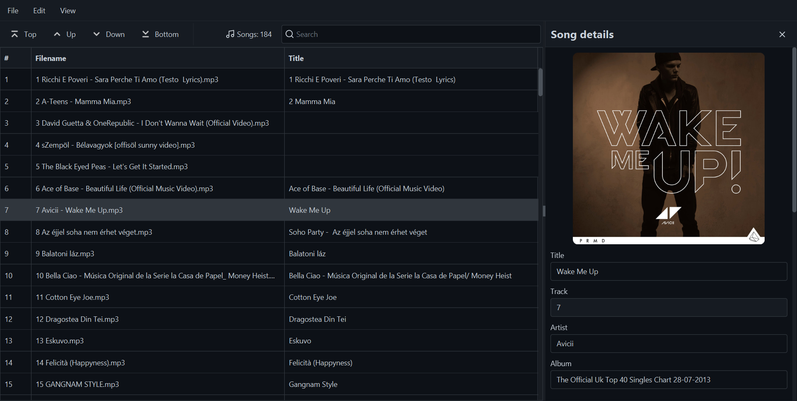

  

<h1 align=center>MP3 Reorder</h1>

## What is MP3 Reorder?
An app designed to reorder MP3 files using their track field. The app includes useful tools to make reordering easy, such as:
- Automatically setting tracks based on file names
- Resolving track conflicts
- Inserting and switching songs and tracks

The app can also change other MP3 metadata fields, such as title, artist, genre, and more.

## Images

## Libraries used
- [mp3agic](https://github.com/mpatric/mp3agic)
- [atlantafx](https://github.com/mkpaz/atlantafx)