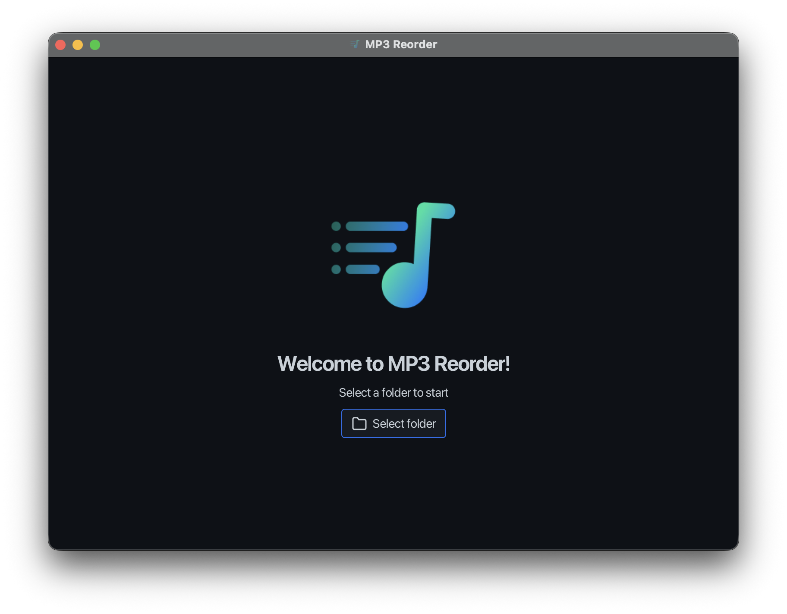
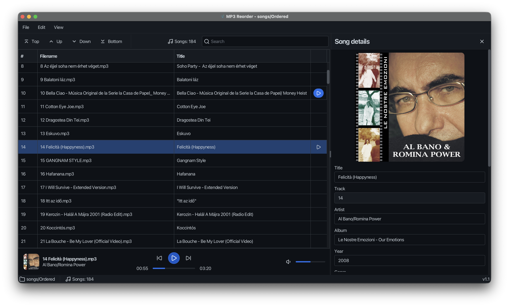
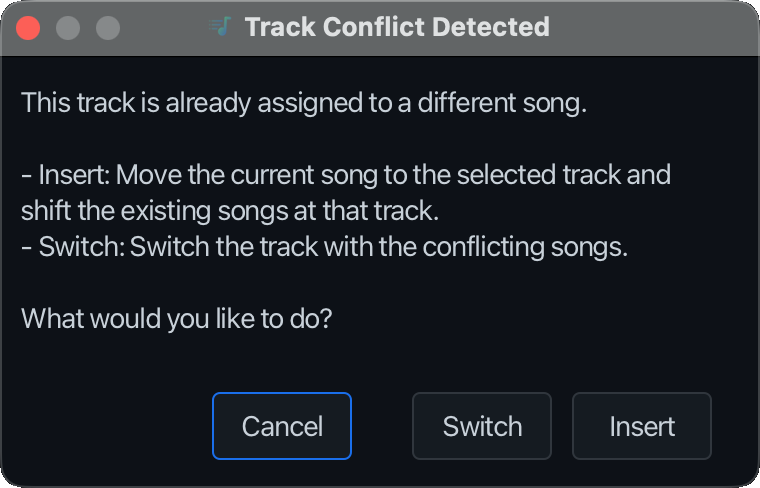
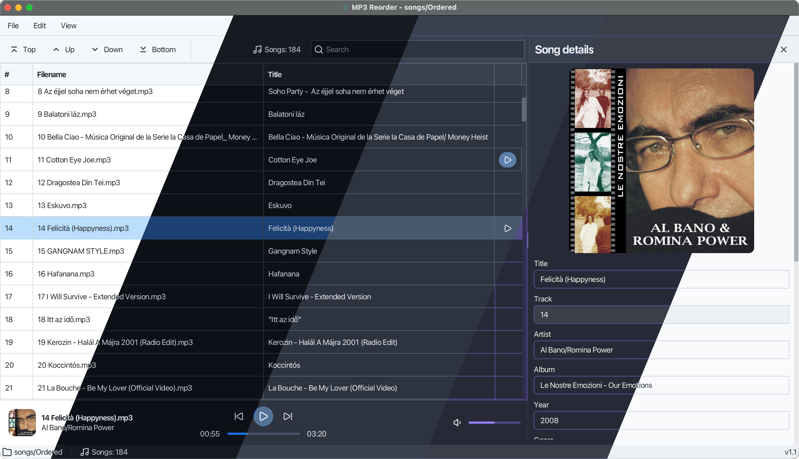

<div align="center">
  
  <h1>MP3 Reorder</h1>

  <p><i>A cross-platform desktop application designed to reorder MP3 files using their track field.</i></p>

  
  
  
</div>

---

## What is MP3 Reorder?

MP3 Reorder is a desktop application designed to help you organize your local music library. The core focus of the app
is editing the MP3 `track` field, but it also functions as a general ID3 tag editor for modifying titles, artists,
genres, and more.

## How it works
- Select a folder containing your `.mp3` files.
- The app loads the `.mp3` files, ignores corrupted files, and does not scan subfolders.
- It checks each song’s track field and assigns a valid track number if the existing one is invalid.
- The application enforces track numbering. It only allows assigning tracks within the range of 1 to the total number of
loaded songs.
- You can edit the `track` and other `ID3` tags directly in the app, as well as rename the files.
- Songs can be saved to the currently open directory, in which case the original files will be updated with your changes. If you rename a song, the original file will be replaced with the renamed version.
- You can also choose a different save location, where all songs will be saved along with any changes made to them.

## Features

### Track Management

- **Track Assigner:** Automatically set tracks based on file names.
- **Conflict Resolution:** The app detects track issues such as tracks being in an invalid range or if there are
  duplicates. If a song has an invalid track, the app will automatically assign it a valid one.
- **Drag & Drop:** Reorder songs by simply dragging them in the list.
- **Editing:** Insert, switch tracks, and modify MP3 fields (title, artist, genre, etc.).
- **Search:** Search loaded files with multi-result capabilities.

### Playback and system integration

- Built-in Player: Listen to your tracks directly within the app. (On some Linux distributions, the JavaFX MediaPlayer might fail to initialize. In this case, installing the `ffmpeg-compat-57` package might solve the issue.)
- System Integration: Open songs in your default music player or reveal them directly in your file explorer.

### UI

Built with JavaFX and the [AtlantaFX](https://github.com/mkpaz/atlantafx) theme library.

- **Cross-Platform:** Native support for Windows, macOS, and Linux.
- **Themes:** Includes 7 built-in themes.
- **Native Menubar:** If enabled, the app can use the native menubar of the operating system (if the platform supports
  it).
- **Localization:** Supports English and Hungarian.

---

### File locations

| Platform    | Logs                                       | Preferences                                                              |
| ----------- | ------------------------------------------ | ------------------------------------------------------------------------ |
| **Windows** | `%APPDATA%\MP3Reorder\logs`                | `%APPDATA%\MP3Reorder\preferences.properties`                            |
| **Linux**   | `~/.MP3Reorder/logs`                       | `~/.MP3Reorder/preferences.properties`                                   |
| **macOS**   | `~/Library/Logs/MP3Reorder`                | `~/Library/Application Support/MP3Reorder/preferences.properties`        |

## Getting Started

### Prerequisites

- JDK 25

### Run the App

```bash
git clone https://github.com/robothaver/MP3-Reorder.git
cd MP3-Reorder
./gradlew run
```

### Build Executable

To build a native, standalone executable for your current operating system using Jlink and JPackage:

```bash
./gradlew jpackageImage
```

## Screenshots




<div align="center">
  
</div>



## Libraries used

- [mp3agic](https://github.com/mpatric/mp3agic)
- [atlantafx](https://github.com/mkpaz/atlantafx)
